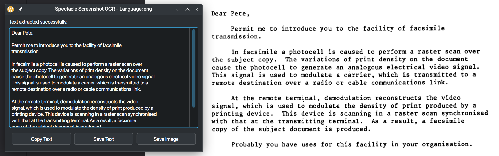

# Spectacle OCR Screenshot

A simple Qt application that integrates KDE Spectacle screenshot tool with Tesseract OCR to extract text from screenshots.



## Features

- Capture screenshots using KDE's Spectacle tool
- Extract text from screenshots using Tesseract OCR
- Support for multiple languages
- Edit extracted text before saving
- Copy text to clipboard
- Save text to file
- Save the screenshot as .png

## Requirements

- Qt 6.x
- Tesseract OCR 
- Leptonica
- KDE Spectacle

## Installation

### From Packages

You can download the pre-built packages from the [Releases Page](https://github.com/funinkina/spectacle-ocr-screenshot/releases/).

### Building from Source

1. Clone the repository:

```bash
git clone https://github.com/yourusername/spectacle-ocr-screenshot.git
cd spectacle-ocr-screenshot
```

2. Install build dependencies:

For Arch Linux:
```bash
sudo pacman -S qt6-base tesseract leptonica spectacle
```

For Ubuntu/Debian:
```bash
sudo apt install qt6-base-dev libtesseract-dev libleptonica-dev spectacle
```

For Fedora:
```bash
sudo dnf install qt6-qtbase-devel tesseract-devel leptonica-devel spectacle
```

3. Build the project:

```bash
git clone https://github.com/funinkina/spectacle-ocr-screenshot
qmake6 simple.pro
make
```

### You can also build using `cmake`:
Make sure you have cmake installed!

```bash
mkdir build && cd build
cmake ..
make
```

## Usage

Run the application:

```bash
./spectacle-ocr-screenshot
```

## Recommended Usage
Create a symlink to the executable in your local `PATH` for easy access:

```bash
sudo ln -s spectacle-ocr-screenshot /usr/local/bin/
```

Then you can run the application from anywhere using or by assigning a keyboard shortcut to `spectacle-ocr-screenshot`

## The application will:
1. Launch Spectacle in region selection mode
2. After capturing, click on save, this will save to `/tmp`
3. The extracted text will be displayed in the application window
4. You can edit the text, copy it to clipboard or save it to a file

### Command Line Options

- `--lang <language>`: Specify the language(s) for OCR (default: eng)
  - Use ISO 639-3 language codes
  - For multiple languages, join them with '+' (e.g., `--lang eng+hin` for English and Hindi)

Examples:
```bash
# Use English OCR (default)
./spectacle-ocr-screenshot

# Use German OCR
./spectacle-ocr-screenshot --lang deu

# Use multiple languages (English and Spanish)
./spectacle-ocr-screenshot --lang eng+spa
```

## Available Languages

Tesseract OCR supports many languages. Some common language codes:

- `eng` - English
- `deu` - German
- `fra` - French
- `spa` - Spanish
- `ita` - Italian
- `rus` - Russian
- `jpn` - Japanese
- `kor` - Korean
- `chi_sim` - Chinese (Simplified)
- `chi_tra` - Chinese (Traditional)
- `ara` - Arabic
- `hin` - Hindi

You may need to install language packs for Tesseract OCR separately.

## License

[MIT](https://github.com/funinkina/spectacle-ocr-screenshot/blob/main/LICENSE)
